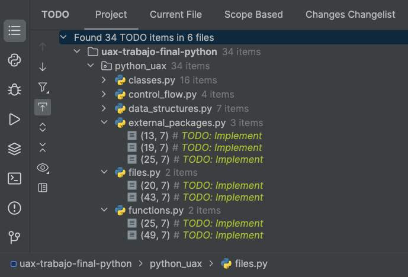
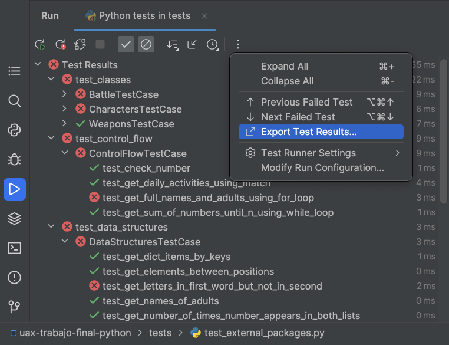
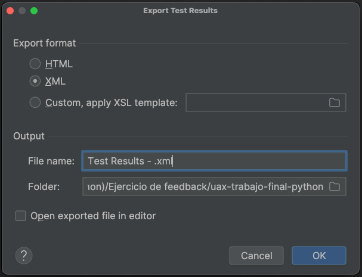
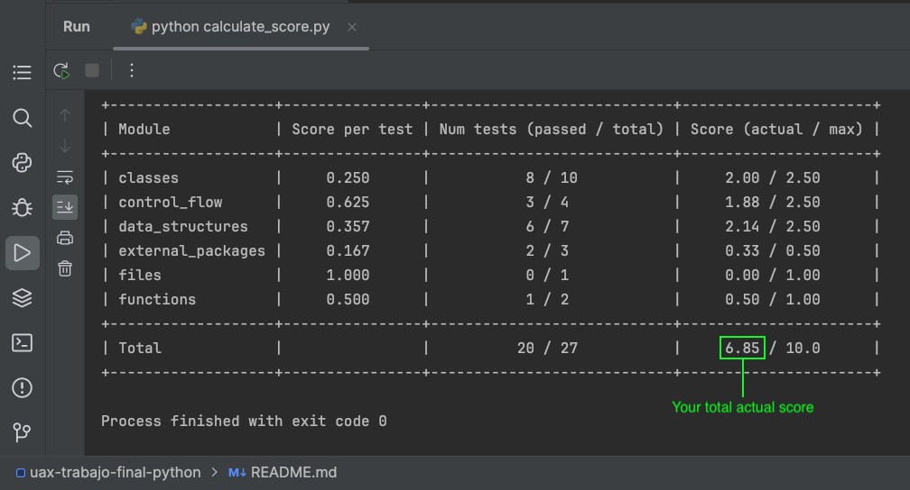
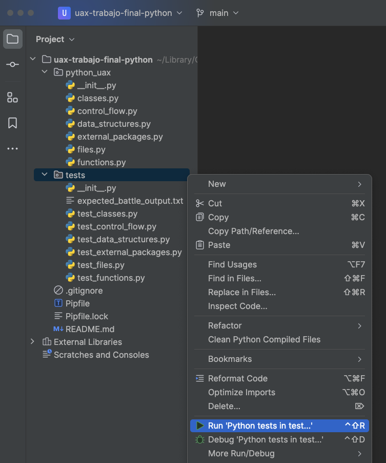
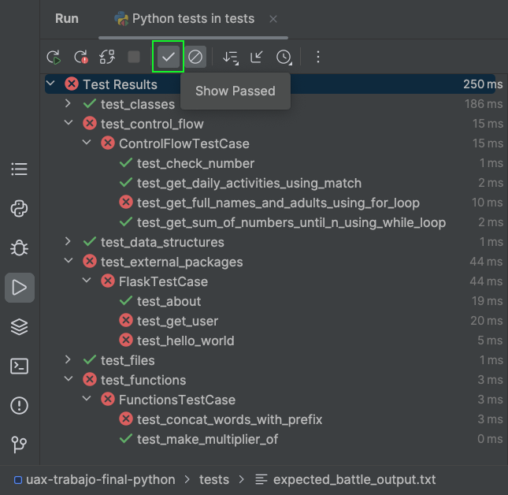
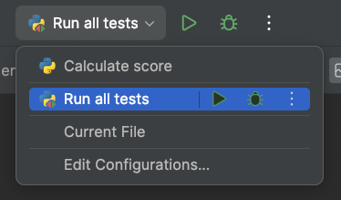

# Trabajo final Python

## Prerequisites

* Install [pyenv](https://github.com/pyenv/pyenv#installation)
* Install [pipenv](https://pipenv.pypa.io/en/latest/installation.html#preferred-installation-of-pipenv)
* Recommended IDE: [PyCharm](https://www.jetbrains.com/es-es/pycharm/)

## Configure project

1. Install Python 3.12.0: `pyenv install 3.12.0`
2. Set Python 3.12.0 as global version: `pyenv global 3.12.0`
3. Show the absolute path to Python 3.12.0 interpreter: `pyenv which python3`
4. Store that path for later use
5. Open this project folder with PyCharm
6. Open `PyCharm > Preferences... > Project: trabajo-final-python > Python Interpreter`
7. Click on `Add Interpreter > Add Local Interpreter...`
8. Select `Pipenv Environment`
9. Click on the `...` next to `Base Interpreter` and paste the path stored in step 4
10. Click on `Ok`
11. Click on `Ok`

## Project objective

The idea of this project is to test your Python skills. To do so, you will have to implement some functions, located in the `python_uax` package.

All the functions you need to implement are marked as follows:

```python
def sample_function():
  # TODO: Implement
  pass
```

__You only have to implement the code inside those functions. You cannot modify the function signature.__

To assist you in finding the functions to implement, you can use the `TODO` tool provided by PyCharm.
To do so, go to `View > Tool Windows > TODO` and you will see a list of all the functions you need to implement.



To check if your implementation is correct, you can run the tests located in the `tests` package (see [execute tests section](#execute-tests)).

__You cannot modify the tests.__

## Evaluation criteria

__The score will only be based on the tests.__ Therefore, to obtain the maximum score, all the tests must pass.

The score of each module is as follows:

| Module                                                  | Total score | Num tests | Score per test |
|---------------------------------------------------------|-------------|-----------|----------------|
| [data_structures.py](python_uax/data_structures.py)     | 2.5         | 7         | 0.357          |
| [control_flow.py](python_uax/control_flow.py)           | 2.5         | 4         | 0.625          |
| [functions.py](python_uax/functions.py)                 | 1           | 2         | 0.5            |
| [files.py](python_uax/files.py)                         | 1           | 1         | 1              |
| [external_packages.py](python_uax/external_packages.py) | 0.5         | 3         | 0.167          |
| [classes.py](python_uax/classes.py)                     | 2.5         | 10        | 0.25           |
| __Total__                                               | 10          | 27        |                |

The score of each module is calculated based on the number of passed tests.
For example, the [classes.py](python_uax/classes.py) module has 10 tests, so each test is worth 0.25 points (`2.5 / 10 = 0.25`).
If you pass 8 tests, you will get 2 points (`8 * 0.25 = 2`).

All the tests of the same module are worth the same.

### Calculate score

The project contains a [calculate_score.py](calculate_score.py) Python script that automates the process of calculating the score.

You can use it to calculate your score, by following these steps:

1. Run all the tests (see [execute tests section](#execute-tests))
2. Export the test results to an XML file  
   
   
3. Run the script: `python calculate_score.py`  
   

## Execute tests

In PyCharm, to execute all tests and see the results properly, right-click the tests folder and select `Run 'Python tests in test...'` option:



To better identify which tests passed and which not, it is recommended to enable the `Show Passed` option:



## PyCharm run configurations

The project contains some PyCharm run configurations that you can use to execute the tests and calculate the score.

These configurations are located in the `.idea/runConfigurations` folder, and are automatically loaded by PyCharm.

You can use them by clicking in the top-right corner of PyCharm and selecting the desired configuration:



## Other info

* The recommended order to implement the modules is the following:
  1. [data_structures.py](python_uax/data_structures.py)
  2. [control_flow.py](python_uax/control_flow.py)
  3. [functions.py](python_uax/functions.py)
  4. [files.py](python_uax/files.py)
  5. [external_packages.py](python_uax/external_packages.py)
  6. [classes.py](python_uax/classes.py)
* For the [files.py](python_uax/files.py) module there is only one test in [test_files.py](tests/test_files.py)
  (`test_append_and_read_file`), that tests both functions (`append_to_file` and `read_file`) at the same time.
  Therefore, to be able to pass the test, both functions must work properly.
* The [classes.py](python_uax/classes.py) module doesn't provide as much docstrings as the other modules,
  because that would lead to more difficult to read code. Instead, the expected behavior is deeply explained in the tests
  ([test_classes.py](tests/test_classes.py)). This also tests your ability to understand the tests.
