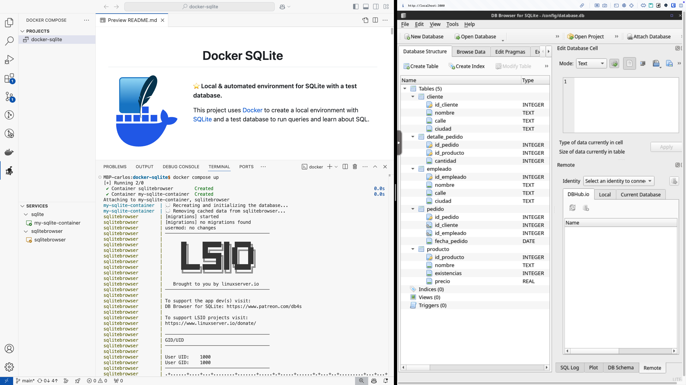
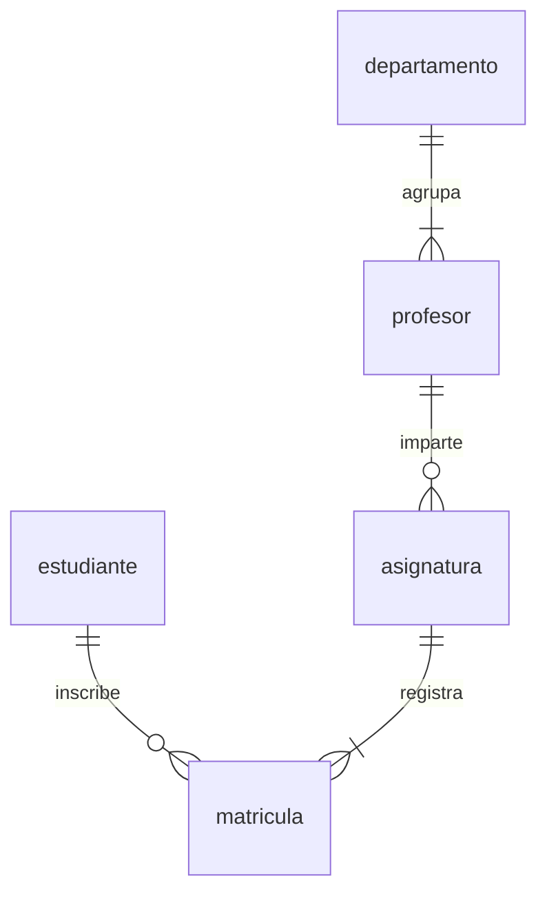
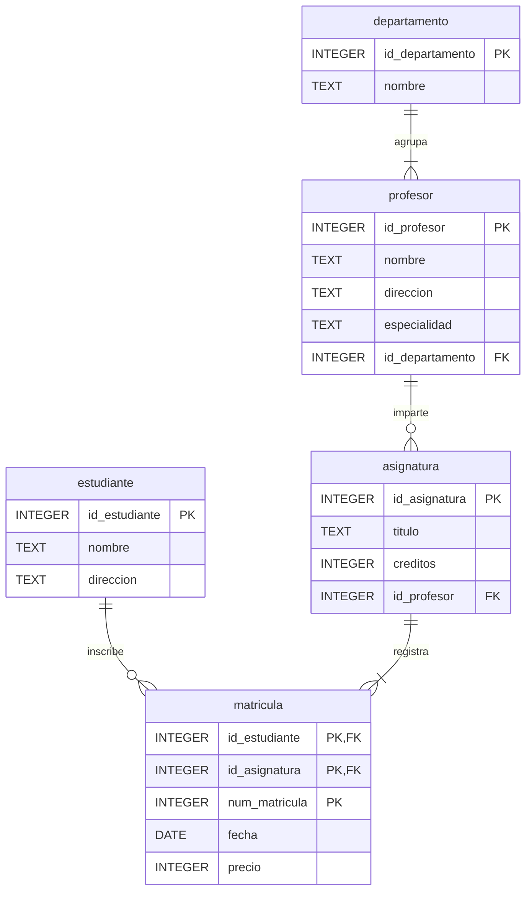
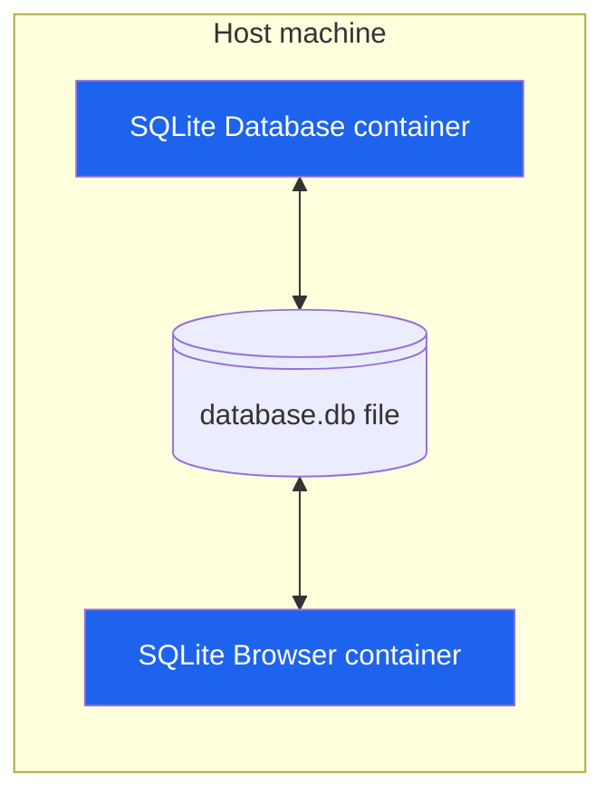

<h1 align="center">UAX Trabajo final SQL</h1>

<a href="#"></a>

<br />

__⭐️ Local & automated environment for SQLite with a test database.__

This project uses [Docker](https://www.docker.com/) to create a local environment with [SQLite](https://www.sqlite.org/) and a test database to run queries and learn about SQL.

<br /><br /><br />

## Demo



## What do you need to do?

Your mission here is to implement the SQL queries described in the [queries.sql](database/scripts/dql/queries.sql) file.

Each query to be implemented is described in a comment block followed by a `-- TODO: Implement` message.

Below you have explained the entity relationship model of the database and the architecture of the environment
that you will use to inspect the database and run the queries.

You should take a look at the following scripts as well in order to fully understand the database structure and
the initial data that is available:

* [create.sql](database/scripts/ddl/create.sql)
* [insert.sql](database/scripts/dml/insert.sql)

## Entity relationship model

The following diagrams show the entity relationship model of the database.

### Simplified version




### Detailed version (with attributes)



Take a look at [Mermaid Entity Relationship Diagrams documentation](https://mermaid.js.org/syntax/entityRelationshipDiagram.html)
for more information about the syntax.

## Architecture

The [docker-compose.yml](docker-compose.yml) file specifies how containers should be executed.

The following diagram shows the architecture:



The `SQLite Database container` is used to run the SQLite database and the `SQLite Browser container`
is used to run a GUI to interact with the database.

The [./database/data/database.db](./database/data/database.db) file is used to store the database data in binary format.

The [./database](./database) folder of the repository is mounted to the `/database` folder in the `SQLite Database container`.
This makes initialization scripts available to the container and allows the database data to persist even if the container is removed.

The [./database/data](./database/data) folder of the repository is mounted to the `/config` folder in the `SQLite Browser container`.
This makes the database data file available to the `SQLite Browser container` so that it can be opened in the GUI.
`/config` is the user home directory in the container, so it's the folder that is opened by default in the GUI, making it easy to open the database.

With this approach, __the database data is stored in the host machine and can be accessed by both containers__.
There is no need to establish a network connection between the containers.

## Prerequisites

* [Install Docker Desktop](https://www.docker.com/products/docker-desktop/)

## Steps to run the environment

Open a terminal in the project root folder.

### 1. Execute the docker containers

First, we need to __execute Docker Desktop__. Just start the application and wait for it to be ready.

There are two ways to start the database:
- __Recreating and initializing the database with the initial test data__
- __Starting the database with the existing data__ (the data from the previous execution)

To start the database with the __1st option__, simply execute the following command:

```shell
docker compose up
```

To start the database with the __2nd option__, continue reading.

The execution mode is controlled by the `RECREATE_DATABASE_WITH_INITIAL_TEST_DATA` environment variable
in the [docker-compose.yml](docker-compose.yml) file. This variable is set to `true` by default, which means
that the database will be recreated and initialized with the initial test data if the user does not change it
(as shown in the command above).

The value of that environment variable can be changed in the CLI by setting a system environment variable before
running the containers. That system environment variable is used to populate the container environment variable,
which is then used in the [initialize-database.sh](database/scripts/initialize-database.sh) script to determine if
the database should be recreated or not.

This can be done in a single command as follows:

```shell
# MacOS/Linux
RECREATE_DATABASE_WITH_INITIAL_TEST_DATA=false docker-compose up

# Windows
set RECREATE_DATABASE_WITH_INITIAL_TEST_DATA=false && docker-compose up
```

We can also set that environment variable to `true` in order to start the database with the __1st option__:

```shell
# MacOS/Linux
RECREATE_DATABASE_WITH_INITIAL_TEST_DATA=true docker-compose up

# Windows
set RECREATE_DATABASE_WITH_INITIAL_TEST_DATA=true && docker-compose up
```

<details>
<summary>Some interesting Docker commands</summary>

| Commmand                                  | Description                                                                                                                            |
| ----------------------------------------- | -------------------------------------------------------------------------------------------------------------------------------------- |
| `docker stats`                            | Display a live stream of container(s) resource usage statistics. <br /> Useful to monitor Docker containers memory usage.              |
| `docker container ls --all`               | List all Docker containers (running or not). <br /> If both containers specify "Up" in the status column, everything is running fine.   |
| `docker logs <containerid>`               | Fetch the logs of a container. <br /> Really useful to see what's going on.                                                            |
| `docker top <containerid>`                | Display the running processes of a container                                                                                           |
| `docker exec -it <containerid> <command>` | Run a command in a running container (in interactive mode)                                                                             |
| `docker images`                           | List images                                                                                                                            |
| `docker version`                          | Show the Docker version information                                                                                                    |
| `docker info`                             | Display system-wide information                                                                                                        |

</details>

### 2. Open the SQLite Browser and connect to the database

Open a web browser and go to [http://localhost:3000](http://localhost:3000).

To open the database, click on the `Open Database` button, select the `database.db` file and click `Open`.

__🚀 Now you can inspect the database and run queries.__

### 3. Stop the containers

After executing the command `docker compose up`, the containers will be running and the terminal will be blocked.

To stop the containers, just press `Ctrl + C` in the terminal.

If you want to start them again, just go back to step 1.

### (Optional) Connect to one of the Docker containers

If you want to connect to one of the Docker containers, you have to open a new terminal window,
because the current terminal is blocked by the containers.

Obtain the name of the container you want to connect to:
```bash
docker container ls --all
```

> The name is the last column.

Execute the sh command in that container to connect to it:
```bash
docker exec -it <container-name> sh
```

To exit a container just press `Ctrl + D`.

## References

* [Docker](https://www.docker.com/)
* [Docker commands](https://docs.docker.com/engine/reference/commandline/docker/)
* [Docker Compose commands](https://docs.docker.com/compose/reference/)
* [Mermaid](https://mermaid.js.org/)
* [SQL As Understood By SQLite](https://www.sqlite.org/lang.html)
* [Dockerfile of SQLite3](https://github.com/KEINOS/Dockerfile_of_SQLite3)
* [linuxserver docker-sqlitebrowser](https://github.com/linuxserver/docker-sqlitebrowser)
